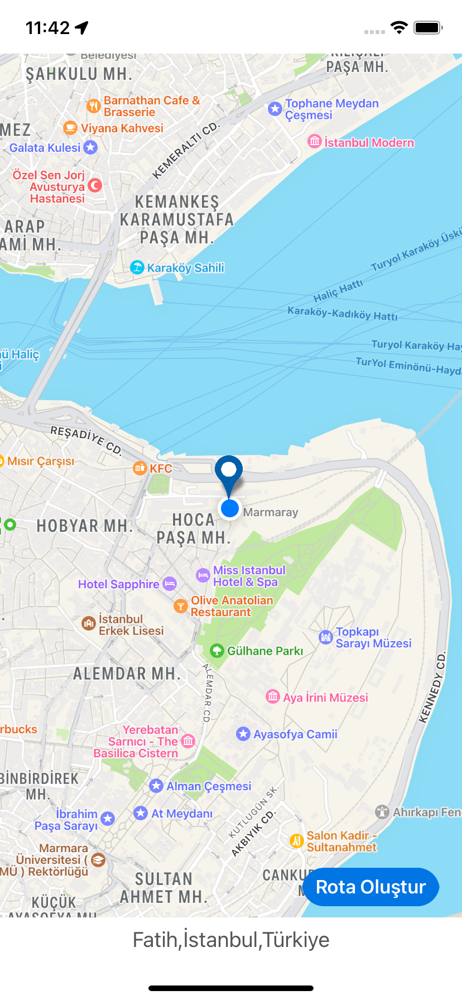
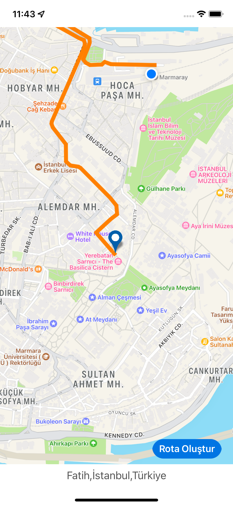

# MapKit Route App

I developed this application to learn about MapKit.

We determine a location on the map and click the create route button. 
Clicking the button creates a route from our current location to the location we have determined.

# Screen
 
